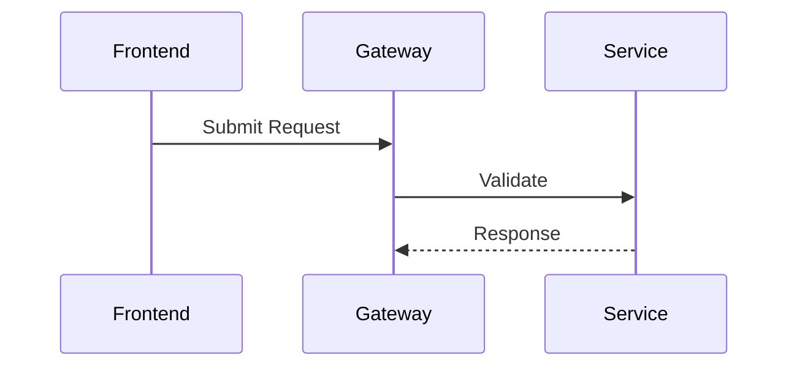

# BA AI Framework

AI-assisted Business Analysis Framework for standardized documentation, reusable templates, and AI-driven workflow generation.

---

# Purpose

This framework is designed to help Business Analysts work more effectively with AI tools such as:

- ChatGPT
- Claude
- Cursor
- Copilot

The goal is to standardize:

- User Story writing
- Acceptance Criteria
- Business Flow
- BPMN
- Sequence Diagram
- State Diagram
- Business Rules
- AI prompting strategy

---

# Core Principles

## AI-First

Documents are written for:
- humans
- AI agents

All standards and templates should be:
- structured
- reusable
- machine-readable
- markdown-first

---

## Consistency

All BA outputs should follow:
- same terminology
- same formatting
- same quality standard

---

## Reusability

Templates and prompts should be reusable across:
- projects
- modules
- domains
- teams

---

# Folder Structure

```txt
ba-ai-framework/
│
├── README.md
│
├── standards/
├── templates/
├── prompts/
├── diagrams/
├── business-rules/
├── glossary/
└── examples/
```

---

# Folder Overview

## standards/

Defines writing standards and formatting rules.

Examples:
- User Story Standard
- AC Standard
- BPMN Standard
- Sequence Diagram Standard

---

## templates/

Reusable markdown templates for common business flows.

Examples:
- CRUD Flow
- Approval Flow
- Integration Flow
- Notification Flow

---

## prompts/

AI prompts for:
- generation
- review
- refinement
- edge-case analysis

Examples:
- Generate User Story
- Generate AC
- Review Edge Cases

---

## diagrams/

Mermaid diagram examples and standards.

Examples:
- BPMN
- Sequence Diagram
- State Machine
- Activity Flow

---

## business-rules/

Reusable business rule libraries.

Examples:
- Authentication Rules
- Insurance Rules
- Payment Rules

---

## glossary/

Business terminology and domain definitions.

---

## examples/

Real examples and reference outputs.

---

# Recommended Workflow

```txt
Requirement
    ↓
AI Bootstrap Prompt
    ↓
Generate User Story
    ↓
Generate AC
    ↓
Generate BPMN
    ↓
Review Edge Cases
    ↓
Finalize Documentation
```

---

# Recommended AI Tools

## Claude

Recommended for:
- long context
- structured analysis
- large documentation generation

---

## ChatGPT

Recommended for:
- refinement
- brainstorming
- diagram generation
- requirement clarification

---

# Markdown Standard

All documents should:
- use markdown
- avoid heavy formatting
- support copy-paste into AI tools
- support Git versioning

---

# Mermaid Standard

All diagrams should use Mermaid syntax whenever possible.

Example:



---

# AI Usage Rules

## Always provide context

When prompting AI:
- attach standards
- attach glossary
- attach business rules

---

## Prefer structured prompts

Good:

```txt
Generate:
- User Story
- Acceptance Criteria
- BPMN
- Edge Cases
```

Bad:

```txt
Help me analyze this feature
```

---

# Framework Phases

## Phase 1
Foundation Standards

## Phase 2
Reusable Templates

## Phase 3
AI Prompt Framework

## Phase 4
Diagram Standards

## Phase 5
Business Rules Library

## Phase 6
Examples Library

---

# Target Outcome

The framework aims to create:

- consistent BA outputs
- AI-assisted analysis workflow
- reusable documentation system
- faster grooming and refinement
- better collaboration between BA, QA, Dev, and PM

---

# Future Direction

Possible future enhancements:

- AI Knowledge Base
- RAG integration
- Vector Search
- Internal BA Copilot
- Automated Requirement Review

---

# Notes

This framework is intentionally lightweight and markdown-first.

The goal is:
- simplicity
- scalability
- AI compatibility
- practical daily usage