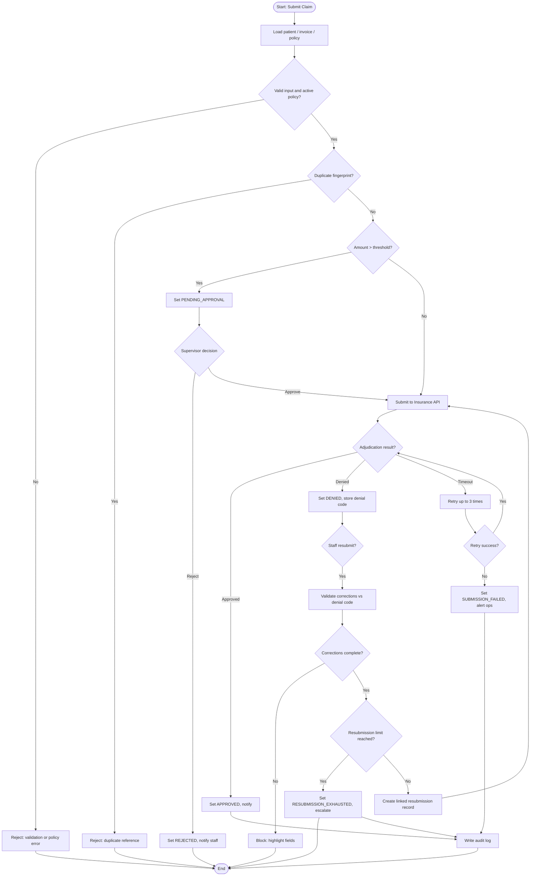
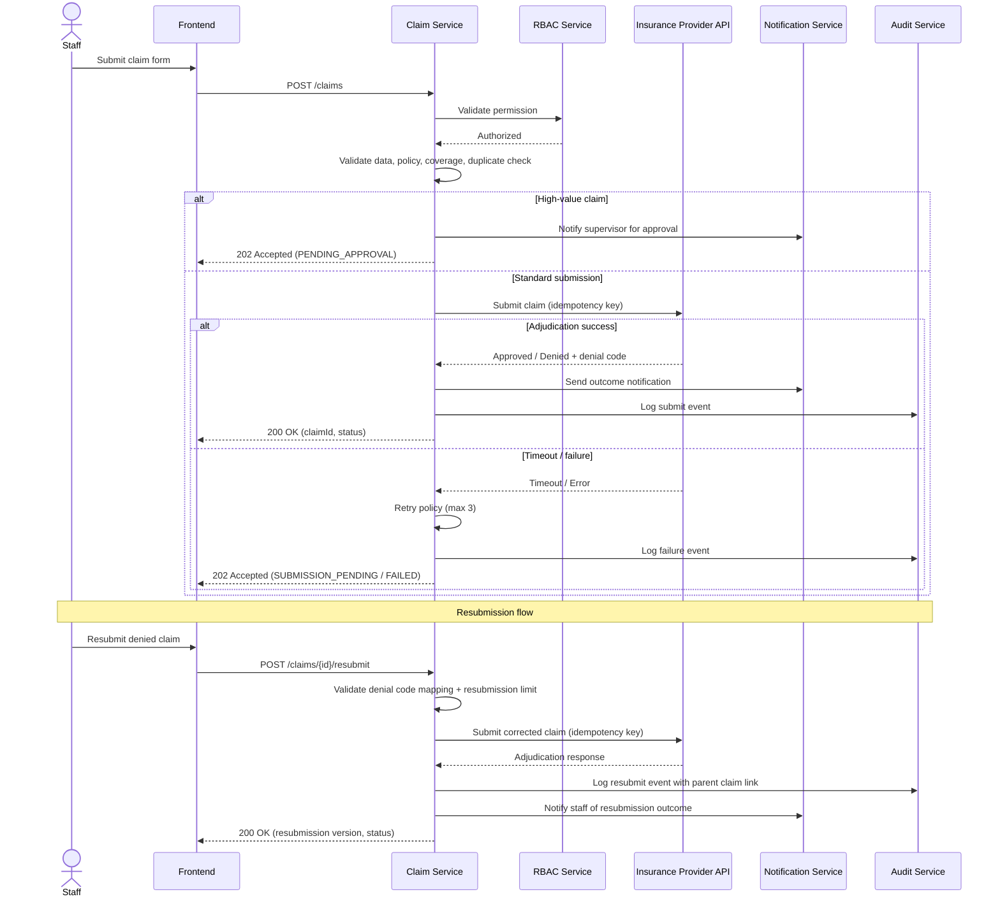
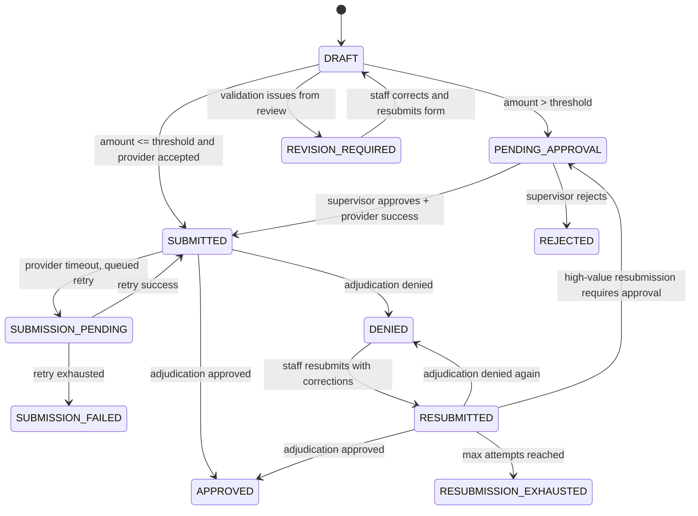

# Insurance Claim — BA Document

## Story Information

| Field | Value |
|---|---|
| Story ID | US-INS-001 |
| Story Name | [INSURANCE] - Submit and Resubmit - Insurance Claim |
| Module | Insurance Claim |
| Feature | Claim Submission, Approval, and Resubmission After Denial |
| Requirement ID | REQ-INS-001 |
| Priority | High |
| Actor | Hospital Staff, Claims Supervisor |
| Status | Draft |
| Version | 1.0 |
| Last Updated | 2026-05-30 |

---

# Business Context

## Problem Statement

Hospital staff submit insurance claims without a standardized validation and approval workflow. Denied claims are resubmitted without clear correction steps, causing repeated denials, duplicate submissions, and poor traceability between original and resubmitted claims.

## Business Goal

Provide a controlled end-to-end claim workflow — from initial submission through supervisor approval to governed resubmission after denial — with full audit trail and insurer integration resilience.

## Success Metrics

- >= 95% claims pass initial validation on first submission
- < 2% duplicate claim submissions
- 100% high-value claims routed through supervisor approval
- >= 80% resubmitted claims corrected on first resubmission attempt
- 100% claim state transitions audit logged
- < 1% claims lost due to integration timeout without recovery path

---

# User Story

As a hospital staff member,
I want to submit an insurance claim and resubmit it with corrections after denial,
So that patient reimbursement is processed accurately without repeated rejections or duplicate submissions.

---

# Actors

- Hospital Staff
- Claims Supervisor
- Claim Service
- Insurance Provider API (Adjudication)
- Notification Service
- Audit Logging Service
- Identity / RBAC Service

---

# Preconditions

- Staff is authenticated and authorized to create or resubmit claims
- Patient profile exists in the system
- Treatment is completed and invoice is finalized
- Insurance policy information is available and linked to the patient
- For resubmission: original claim exists with status `DENIED` and denial code recorded

---

# Trigger

- **Initial submission:** Staff clicks `Submit Claim` on the claim submission screen
- **Resubmission:** Staff clicks `Resubmit Claim` on a denied claim detail screen

---

# Main Flow

## Initial Claim Submission

1. Staff opens claim submission screen for a completed treatment.
2. System loads patient, treatment, invoice, and policy details.
3. Staff verifies and confirms claim details (diagnosis code, service date, claim amount).
4. System validates required fields, policy eligibility, and coverage.
5. System checks for duplicate claim by patient + invoice + treatment date fingerprint.
6. If claim amount exceeds approval threshold, system sets status `PENDING_APPROVAL` and notifies supervisor.
7. If no approval required, system sets status `SUBMITTED` and sends payload to Insurance Provider API.
8. System stores adjudication response (approved, denied, pending) and updates claim status.
9. System sends notification to relevant users based on outcome.
10. System writes audit log for all state transitions.

## Resubmission After Denial

1. Staff opens denied claim detail and reviews denial code and reason (EOB reference).
2. Staff corrects identified fields per denial code mapping guidance.
3. System validates corrections against original denial reason (denial code mapping required).
4. System verifies resubmission window and policy still active on service date.
5. System checks duplicate resubmission prevention (one active resubmission per denied claim).
6. If corrections require supervisor review (high-value or flagged denial code), route to `PENDING_APPROVAL`.
7. System creates resubmission record linked to original claim ID with incremented resubmission version.
8. System submits corrected payload to Insurance Provider API with idempotency key.
9. System updates claim status based on adjudication response.
10. System notifies staff and supervisor of resubmission outcome.
11. System writes audit log linking original claim ID and resubmission version.

---

# Alternative Flow

| Flow ID | Description |
|---|---|
| AF-01 | Claim amount exceeds threshold → route to supervisor approval before provider submission |
| AF-02 | Provider API temporarily unavailable → queue claim for retry and mark as `SUBMISSION_PENDING` |
| AF-03 | Supervisor requests revision → return to staff with reason and status `REVISION_REQUIRED` |
| AF-04 | Denial code indicates missing documentation → staff uploads attachment before resubmission |
| AF-05 | Resubmission partially correct → system highlights remaining fields per denial code mapping |
| AF-06 | Supervisor approves resubmission → proceed to provider submission |

---

# Exception Flow

| Exception ID | Description |
|---|---|
| EX-01 | Insurance policy expired on service date → reject with actionable error |
| EX-02 | Treatment not in coverage list → deny claim with coverage validation message |
| EX-03 | Required fields missing → block submission and highlight fields |
| EX-04 | Unauthorized actor → deny action and log security event |
| EX-05 | Duplicate submission detected → reject and show existing claim reference |
| EX-06 | Claim submitted > 30 days after treatment → reject unless regulatory override applies |
| EX-07 | Resubmission attempted on non-denied claim → block with status error |
| EX-08 | Max resubmission attempts exceeded → set status `RESUBMISSION_EXHAUSTED`, escalate to support |
| EX-09 | Timeout after max retries → set status `SUBMISSION_FAILED`, notify operations queue |
| EX-10 | Policy status changed between approval and submission → re-validate before provider call |

---

# Postconditions

- Claim record is created or updated with full traceability to original (if resubmission)
- Final status is one of: `SUBMITTED`, `PENDING_APPROVAL`, `APPROVED`, `DENIED`, `REVISION_REQUIRED`, `SUBMISSION_PENDING`, `SUBMISSION_FAILED`, `RESUBMITTED`, `RESUBMISSION_EXHAUSTED`
- Denial code and EOB reference stored for denied claims
- Resubmission version linked to parent claim ID
- Audit logs exist for create, approve, reject, submit, resubmit, and state transition events

---

# Acceptance Criteria

## AC-INS-001
Related BR: `BR-INS-001`, `BR-INSURANCE-001`
Given a staff user with create permission and valid claim data with an active policy
When the user submits a claim
Then the system creates the claim with status `SUBMITTED` and returns a claim ID

## AC-INS-002
Related BR: `BR-INS-003`, `BR-INSURANCE-004`
Given claim amount exceeds the configured approval threshold (default 10,000)
When staff submits the claim
Then the system sets status `PENDING_APPROVAL` and notifies the claims supervisor

## AC-INS-003
Related BR: `BR-INSURANCE-002`
Given treatment is not in the patient's insurance coverage list
When staff attempts to submit the claim
Then the system rejects submission with a coverage validation error

## AC-INS-004
Related BR: `BR-INS-001`, `BR-INSURANCE-003`
Given treatment completion date exceeds 30 days and no regulatory override exists
When staff attempts to submit the claim
Then the system rejects submission with submission window error

## AC-INS-005
Related BR: `BR-INS-002`
Given policy status is not active on the service date
When staff attempts to submit the claim
Then the system blocks submission with policy eligibility error

## AC-INS-006
Given missing required fields (patientId, invoiceId, policyNumber, claimAmount, treatmentDate, diagnosisCode)
When staff attempts to submit
Then the system blocks submission and displays field-level validation messages

## AC-INS-007
Given an unauthorized user without claim create permission
When the user attempts claim submission
Then the system denies the action with authorization error and logs a security audit event

## AC-INS-008
Given a duplicate claim request (same patient, invoice, and treatment date)
When the request is submitted
Then the system rejects it and returns the existing claim reference

## AC-INS-009
Related BR: `BR-INSURANCE-001`
Given Insurance Provider API timeout
When retry count is below 3
Then the system retries with an idempotency key and does not create a duplicate claim record

## AC-INS-010
Given Insurance Provider API timeout after 3 retries
When the final retry fails
Then the system sets claim status `SUBMISSION_FAILED`, alerts operations, and allows controlled resubmission

## AC-INS-011
Given a claim with status `DENIED` and a recorded denial code
When staff corrects fields per denial code mapping and clicks resubmit
Then the system creates a resubmission record linked to the original claim with version incremented by 1

## AC-INS-012
Given a denied claim where required corrections are incomplete per denial code mapping
When staff attempts resubmission
Then the system blocks resubmission and highlights fields that must be corrected

## AC-INS-013
Given a claim that has reached the maximum resubmission limit (3 attempts)
When staff attempts another resubmission
Then the system sets status `RESUBMISSION_EXHAUSTED` and escalates to the support queue

## AC-INS-014
Given supervisor rejects a pending approval claim
When a rejection reason is provided
Then the system sets status `REJECTED`, records the reason, and notifies staff

## AC-INS-015
Given two staff users submit the same claim fingerprint concurrently
When both requests are processed
Then the system allows only one claim record and returns duplicate reference for the second request

---

# Business Rules

| Rule ID | Rule Name | Statement | Priority |
|---|---|---|---|
| BR-INS-001 | Claim Submission Window | IF treatment completion date exceeds 30 days THEN reject claim submission | HIGH |
| BR-INS-002 | Policy Eligibility | IF policy status is not active on service date THEN claim cannot proceed | CRITICAL |
| BR-INS-003 | High-Value Claim Approval | IF claim amount exceeds configured threshold THEN supervisor approval required before submission | CRITICAL |
| BR-INS-004 | Duplicate Prevention | IF claim fingerprint (patient + invoice + treatment date) already exists THEN reject duplicate | HIGH |
| BR-INS-005 | Idempotent Provider Submission | Provider submission must use idempotency key to prevent double submission | HIGH |
| BR-INS-006 | Audit Logging | All claim state transitions must be audit logged | CRITICAL |
| BR-INS-007 | Denial Code Mapping | Resubmission must validate corrections against mapped denial code requirements | HIGH |
| BR-INS-008 | Resubmission Limit | Maximum 3 resubmission attempts per denied claim before escalation | MEDIUM |
| BR-INS-009 | Resubmission Linkage | Every resubmission must reference original claim ID and version number | HIGH |
| BR-INSURANCE-001 | Insurance Validity Check | IF insurance expiry date < current date THEN reject claim | CRITICAL |
| BR-INSURANCE-002 | Coverage Validation | IF treatment not covered THEN deny insurance payment | HIGH |
| BR-INSURANCE-003 | Claim Submission Window | IF claim submitted > 30 days after treatment THEN reject (unless emergency/regulatory override) | HIGH |
| BR-INSURANCE-004 | Pre-Approval Requirement | IF treatment cost > threshold THEN require pre-approval before treatment | CRITICAL |

---

# Validation Rules

| Field | Validation |
|---|---|
| patientId | Required, must reference existing patient |
| invoiceId | Required, must reference existing finalized invoice |
| policyNumber | Required, valid format, policy active on service date |
| claimAmount | Required, numeric, > 0 |
| treatmentDate | Required, cannot be in future, within submission window |
| diagnosisCode | Required for insurance claims, valid ICD/procedure code format |
| denialCode | Required on resubmission, must map to known correction checklist |
| attachmentIds | Required when denial code indicates missing documentation |
| resubmissionReason | Required on resubmission, min 10 characters |

---

# Permissions

| Role | Permission |
|---|---|
| Hospital Staff | Create claim, view own claims, resubmit denied claims, upload supporting documents |
| Claims Supervisor | Approve/reject pending claims, approve resubmissions, view team claims |
| Finance Admin | View all claims, export reports, configure approval threshold |
| Operations Support | Handle `SUBMISSION_FAILED` and `RESUBMISSION_EXHAUSTED` escalations |
| System | Execute retry jobs, send notifications, write audit logs |

---

# Dependencies

- Insurance Provider API (adjudication, denial codes, EOB)
- Notification Service (email, SMS, in-app)
- Audit Logging Service
- Identity / RBAC Service
- Document Storage Service (claim attachments)
- Message Queue (retry and async notification jobs)

---

# Assumptions

- Insurance Provider API supports idempotency keys and standard denial code catalog
- Approval threshold is configurable per module (default: 10,000)
- Denial code mapping table is maintained and synced from insurer
- Notification templates exist for each status transition
- Regulatory override for submission window requires supervisor authorization

---

# Out of Scope

- Claim payment settlement and remittance processing
- Fraud scoring or predictive denial analytics
- Multi-provider split claim submission
- Patient-facing claim status portal

---

# BPMN (Mermaid)

---

# Sequence Diagram (Mermaid)

---

# State Diagram (Mermaid)

---

# Edge Case Review

## Edge Case 1
### Scenario
Two staff users submit the same claim within seconds.
### Trigger
Concurrent POST /claims with identical patient + invoice + treatment date.
### Risk / Business Impact
Duplicate records and double submission to insurer.
### Recommendation
Database uniqueness constraint on claim fingerprint + idempotency key + distributed lock.
### Severity
HIGH
### Linked Artifact IDs
US-INS-001, BR-INS-004, AC-INS-008, AC-INS-015

## Edge Case 2
### Scenario
Supervisor approves a claim while policy status changes to expired.
### Trigger
Policy cancellation event between approval and provider submission.
### Risk / Business Impact
Invalid approved claim and downstream insurer rejection.
### Recommendation
Re-validate policy status immediately before every provider API call.
### Severity
HIGH
### Linked Artifact IDs
US-INS-001, BR-INS-002, EX-10, AC-INS-005

## Edge Case 3
### Scenario
Staff resubmits with corrected diagnosis code but denial was for missing attachment.
### Trigger
Incomplete denial code mapping validation.
### Risk / Business Impact
Repeated denial and wasted resubmission attempt count.
### Recommendation
Enforce denial-code-to-required-fields mapping before allowing resubmission.
### Severity
HIGH
### Linked Artifact IDs
US-INS-001, BR-INS-007, AC-INS-012

## Edge Case 4
### Scenario
Retry job succeeds but UI still shows failed status due to delayed sync.
### Trigger
Async status update lag after background retry completion.
### Risk / Business Impact
Operational confusion and duplicate manual resubmission.
### Recommendation
Event-driven status update with reconciliation worker and visible last-sync timestamp.
### Severity
MEDIUM
### Linked Artifact IDs
US-INS-001, AC-INS-009, AC-INS-010

## Edge Case 5
### Scenario
Notification service outage during claim approval.
### Trigger
Notification delivery failure after successful adjudication.
### Risk / Business Impact
Staff uninformed while claim is actually approved.
### Recommendation
Decouple notification from core transaction; retry notifications asynchronously per BR-NOTI-002.
### Severity
MEDIUM
### Linked Artifact IDs
US-INS-001, AC-INS-001

---

# Data Contract (Summary)

## API-INS-001 — POST /claims

| Field | Type | Required | Description |
|---|---|---|---|
| patientId | string | Yes | Patient reference |
| invoiceId | string | Yes | Finalized invoice reference |
| policyNumber | string | Yes | Active policy number |
| claimAmount | decimal | Yes | Claim amount |
| treatmentDate | date | Yes | Date of service |
| diagnosisCode | string | Yes | Diagnosis / procedure code |
| idempotencyKey | string | Yes | Prevents duplicate provider submission |

## API-INS-002 — POST /claims/{id}/resubmit

| Field | Type | Required | Description |
|---|---|---|---|
| correctedFields | object | Yes | Fields corrected per denial mapping |
| resubmissionReason | string | Yes | Staff explanation for resubmission |
| attachmentIds | string[] | Conditional | Required when denial code indicates missing docs |
| idempotencyKey | string | Yes | Prevents duplicate resubmission |

## EVT-INS-001 — claim.status.changed

| Field | Type | Description |
|---|---|---|
| claimId | string | Claim identifier |
| previousStatus | string | Prior status |
| newStatus | string | Updated status |
| actorId | string | User or system that triggered change |
| timestamp | datetime | Event timestamp |
| parentClaimId | string | Original claim ID (resubmissions only) |

---

# Traceability Matrix

| Requirement ID | User Story ID | BR ID | AC ID | Test Case ID | API/Event ID | Owner |
|---|---|---|---|---|---|---|
| REQ-INS-001 | US-INS-001 | BR-INS-001 | AC-INS-004 | TC-INS-004 | API-INS-001 | BA |
| REQ-INS-001 | US-INS-001 | BR-INS-002 | AC-INS-005 | TC-INS-005 | API-INS-001 | BA |
| REQ-INS-001 | US-INS-001 | BR-INS-003 | AC-INS-002 | TC-INS-002 | API-INS-001 | BA |
| REQ-INS-001 | US-INS-001 | BR-INS-004 | AC-INS-008 | TC-INS-008 | API-INS-001 | QA |
| REQ-INS-001 | US-INS-001 | BR-INS-005 | AC-INS-009 | TC-INS-009 | API-INS-001 | QA |
| REQ-INS-001 | US-INS-001 | BR-INS-006 | AC-INS-001 | TC-INS-001 | EVT-INS-001 | QA |
| REQ-INS-001 | US-INS-001 | BR-INS-007 | AC-INS-012 | TC-INS-012 | API-INS-002 | BA |
| REQ-INS-001 | US-INS-001 | BR-INS-008 | AC-INS-013 | TC-INS-013 | API-INS-002 | BA |
| REQ-INS-001 | US-INS-001 | BR-INS-009 | AC-INS-011 | TC-INS-011 | API-INS-002 | BA |
| REQ-INS-001 | US-INS-001 | BR-INSURANCE-002 | AC-INS-003 | TC-INS-003 | API-INS-001 | BA |

---

# Open Questions

- What is the exact SLA for supervisor approval turnaround?
- Should failed submissions auto-reopen for staff after operations resolves the integration issue?
- Is partial claim save (draft auto-save) required for long claim forms?
- Which denial codes require supervisor approval on resubmission vs. staff-only correction?
- Does the insurer support batch resubmission or only single-claim API calls?

---

# Notes

- Document follows BA AI Framework standards: structured markdown, Gherkin-style AC, RBAC, audit logging, timeout/retry, duplicate prevention, and Mermaid diagrams.
- Domain rules sourced from `domain-packs/insurance/` and `business-rules/INSURANCE-RULES.md`.
- Quality score estimate: 17/20 (Good — ready for grooming with minor open questions resolved).
