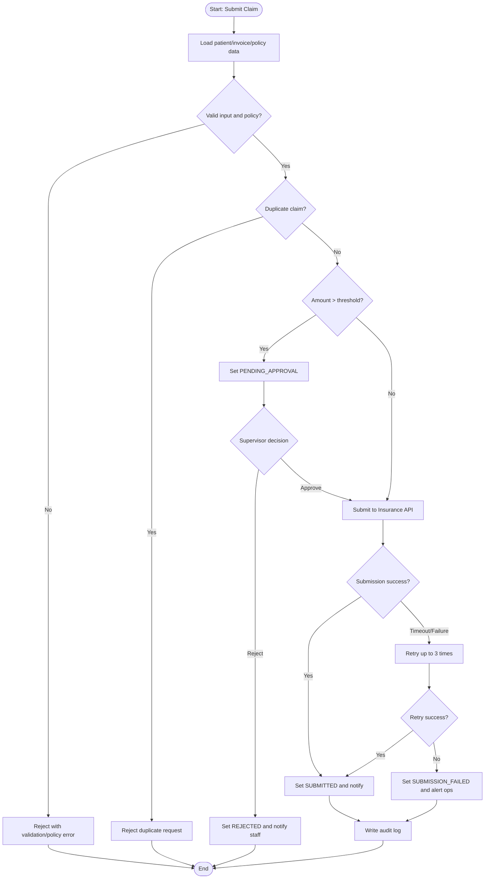
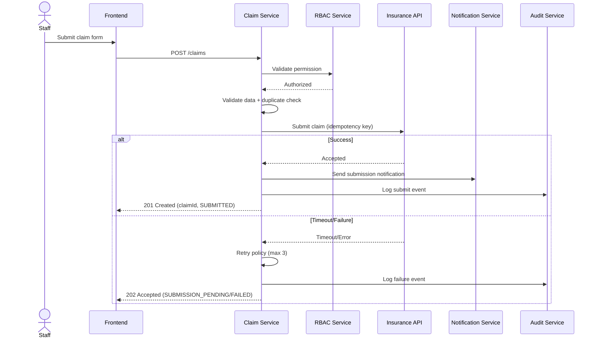
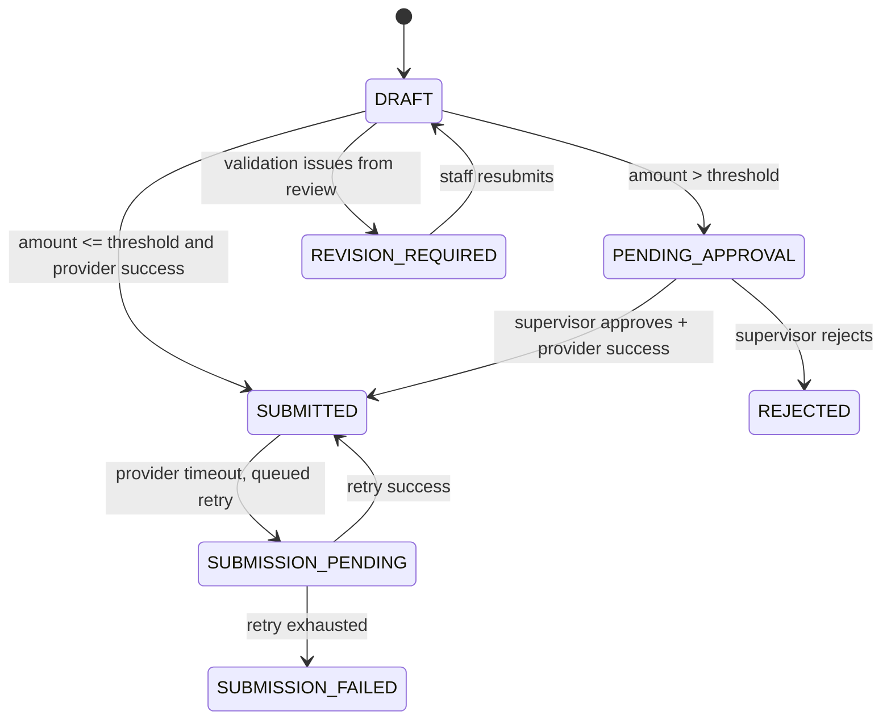

# Full BA Sample Document
## Story Information
| Field | Value |
|---|---|
| Story ID | US-CLAIM-001 |
| Story Name | [CLAIM] - Submit - Insurance Claim |
| Module | Insurance Claim |
| Feature | Claim Submission and Approval |
| Priority | High |
| Actor | Hospital Staff |
| Status | Draft |

---

# Business Context
## Problem Statement
Hospital staff need a standardized workflow to submit insurance claims, validate policy coverage, and route high-value claims for supervisor approval without creating duplicate or invalid submissions.

---

## Business Goal
Reduce claim rejection caused by missing/invalid data and improve claim processing speed with consistent validation and approval flow.

---

## Success Metrics
- >= 95% claims pass initial validation
- < 2% duplicate submissions
- 100% high-value claims follow approval workflow
- 100% claim actions are audit logged

---

# User Story
As a hospital staff,
I want to submit an insurance claim for completed treatment,
So that patient treatment cost reimbursement can be processed accurately and quickly.

---

# Actors
- Hospital Staff
- Supervisor
- Claim Service
- Insurance Provider API
- Notification Service

---

# Preconditions
- Staff is authenticated and authorized to create claims
- Patient profile exists
- Treatment is completed
- Invoice is generated and unpaid balance is finalized
- Insurance policy information is available

---

# Trigger
- Staff clicks `Submit Claim` on the claim submission screen

---

# Main Flow
1. Staff opens claim submission screen.
2. System loads patient, treatment, and invoice details.
3. Staff verifies and confirms claim details.
4. System validates required fields and policy eligibility.
5. System checks duplicate claim by patient + invoice + treatment date.
6. If claim amount > approval threshold, system sets status `PENDING_APPROVAL`.
7. If no approval required, system sets status `SUBMITTED`.
8. System sends claim payload to Insurance Provider API.
9. System stores provider response and updates claim status.
10. System sends notification to relevant users.
11. System writes audit log for all state transitions.

---

# Alternative Flow
| Flow ID | Description |
|---|---|
| AF-01 | Claim amount exceeds threshold -> route to supervisor approval before provider submission |
| AF-02 | Provider API temporarily unavailable -> queue claim for retry and mark as `SUBMISSION_PENDING` |
| AF-03 | Supervisor requests revision -> return to staff with reason and status `REVISION_REQUIRED` |

---

# Exception Flow
| Exception ID | Description |
|---|---|
| EX-01 | Insurance policy expired -> reject submission with actionable error |
| EX-02 | Required fields missing -> block submission and highlight fields |
| EX-03 | Unauthorized actor -> deny action and log security event |
| EX-04 | Duplicate submission detected -> reject and show existing claim reference |
| EX-05 | Timeout after max retries -> set status `SUBMISSION_FAILED`, notify support queue |

---

# Postconditions
- Claim record is created and traceable
- Final status is one of: `SUBMITTED`, `PENDING_APPROVAL`, `REVISION_REQUIRED`, `SUBMISSION_PENDING`, `SUBMISSION_FAILED`, `REJECTED`
- Audit logs exist for create/update/approve/reject/submit events

---

# Acceptance Criteria
## AC-CLAIM-001
Given a staff user with create permission and valid claim data  
When the user submits a claim  
Then the system creates the claim with status `SUBMITTED` and returns a claim ID

## AC-CLAIM-002
Given claim amount exceeds approval threshold  
When staff submits the claim  
Then the system sets status `PENDING_APPROVAL` and notifies supervisor

## AC-CLAIM-003
Given missing required fields  
When staff attempts to submit  
Then the system blocks submission and displays field-level validation messages

## AC-CLAIM-004
Given an unauthorized user  
When the user attempts claim submission  
Then the system denies the action with authorization error and logs audit/security event

## AC-CLAIM-005
Given a duplicate claim request (same patient, invoice, treatment date)  
When the request is submitted  
Then the system rejects it and returns duplicate reference details

## AC-CLAIM-006
Given Insurance Provider API timeout  
When retry count is below 3  
Then the system retries with idempotency key and no duplicate claim creation

## AC-CLAIM-007
Given Insurance Provider API timeout after 3 retries  
When final retry fails  
Then the system sets claim status `SUBMISSION_FAILED`, alerts operations, and allows controlled resubmission

## AC-CLAIM-008
Given supervisor rejects a pending claim  
When rejection reason is provided  
Then the system sets status `REJECTED`, records reason, and notifies staff

---

# Business Rules
| Rule ID | Description |
|---|---|
| BR-CLAIM-001 | Claim must be submitted within 30 days from treatment completion |
| BR-CLAIM-002 | Claim requires valid policy and completed invoice |
| BR-CLAIM-003 | Claims over 10,000 require supervisor approval |
| BR-CLAIM-004 | Duplicate claim is defined by patient + invoice + treatment date |
| BR-CLAIM-005 | Provider submission must be idempotent using request key |
| BR-CLAIM-006 | All claim state transitions must be audit logged |

---

# Validation Rules
| Field | Validation |
|---|---|
| patientId | Required, existing patient |
| invoiceId | Required, existing and finalized invoice |
| policyNumber | Required, valid format, not expired |
| claimAmount | Required, numeric, > 0 |
| treatmentDate | Required, cannot be in future |
| diagnosisCode | Required for insurance claims |

---

# Permissions
| Role | Permission |
|---|---|
| Staff | Create claim, view own claim, resubmit revision |
| Supervisor | Approve/reject pending approval claim |
| Finance Admin | View all claims, export reports |
| System | Execute retry and notification jobs |

---

# Dependencies
- Insurance Provider API
- Notification Service (email/SMS/in-app)
- Audit Logging Service
- Identity/RBAC Service
- Queue system for retry jobs

---

# Assumptions
- Insurance Provider API supports idempotency keys
- Approval threshold is configurable by module
- Notification templates exist for each status transition

---

# Out of Scope
- Claim payment settlement
- Fraud scoring model
- Multi-provider split claim submission

---

# BPMN (Mermaid)

---

# Sequence Diagram (Mermaid)

---

# State Diagram (Mermaid)

---

# Edge Case Review (from REVIEW-EDGE-CASE prompt format)
## Edge Case 1
### Scenario
Two staff users submit the same claim within seconds.
### Risk
Duplicate records and double submission to provider.
### Recommendation
Use database uniqueness + idempotency key + distributed lock on claim fingerprint.
### Severity
HIGH

## Edge Case 2
### Scenario
Supervisor approves a claim while policy status changes to expired.
### Risk
Invalid approved claim and downstream rejection.
### Recommendation
Re-validate policy status immediately before provider submission.
### Severity
HIGH

## Edge Case 3
### Scenario
Retry job succeeds but UI still shows failed status due to delayed sync.
### Risk
Operational confusion and duplicate manual resubmission.
### Recommendation
Event-driven status update with reconciliation worker and visible last-sync timestamp.
### Severity
MEDIUM

## Edge Case 4
### Scenario
Notification service outage during claim submission success.
### Risk
Users are uninformed while claim is actually submitted.
### Recommendation
Decouple notification from core transaction and retry notifications asynchronously.
### Severity
MEDIUM

---

# Open Questions
- What exact SLA applies to supervisor approval turnaround?
- Should failed submissions auto-reopen for staff after operations resolves issue?
- Is partial claim save (draft auto-save) required for long forms?

---

# Notes
- This sample follows repository standards for structured markdown outputs, Gherkin-style AC, RBAC, audit logging, timeout/retry, and Mermaid-based flow visualization.
